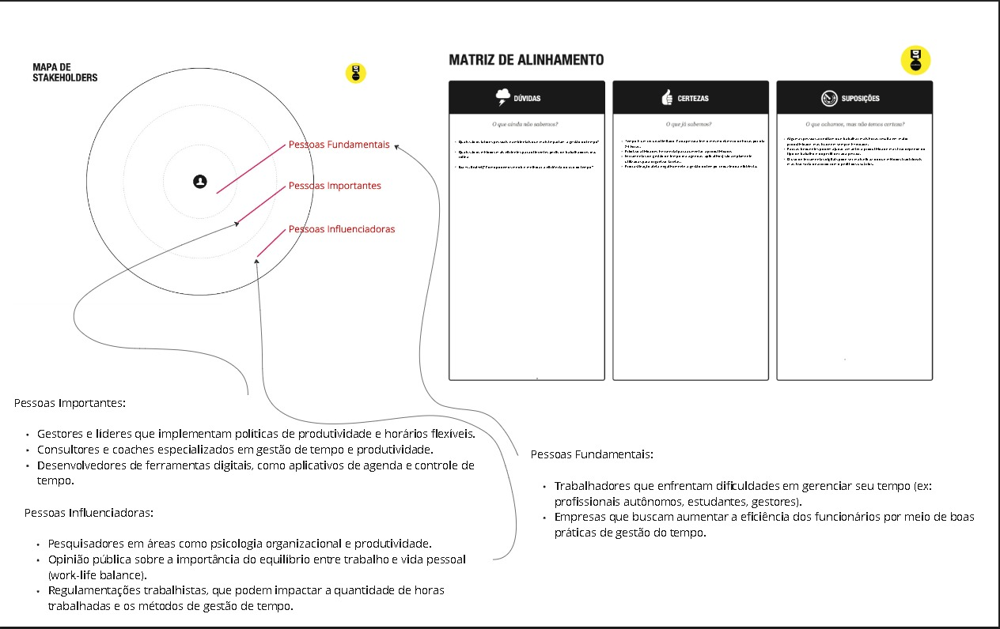
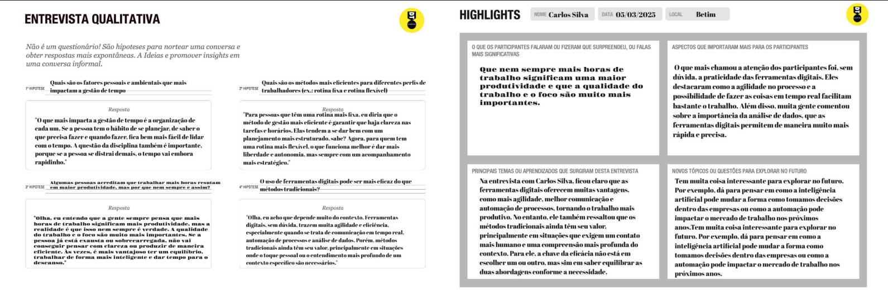
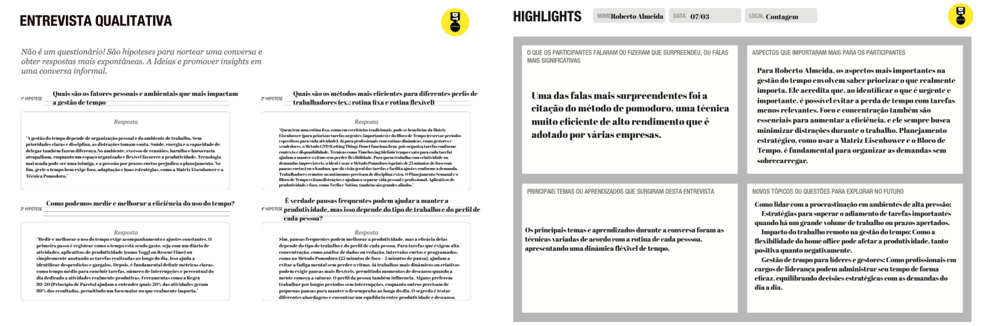
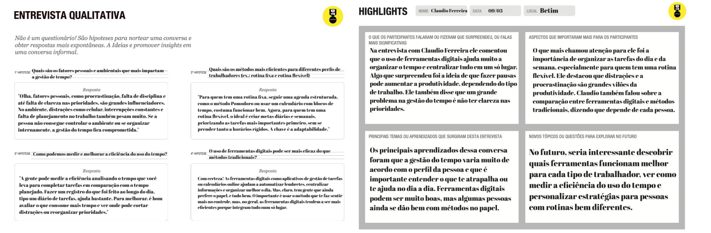
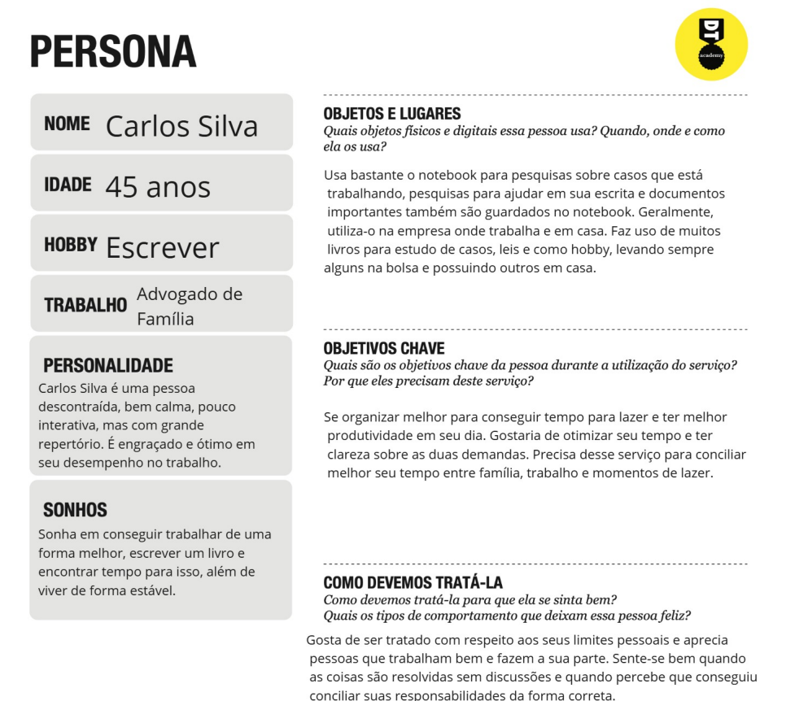
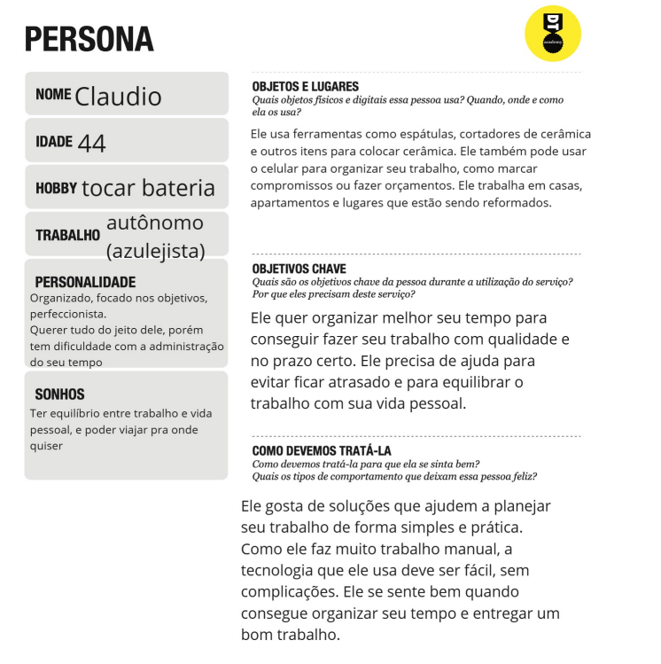
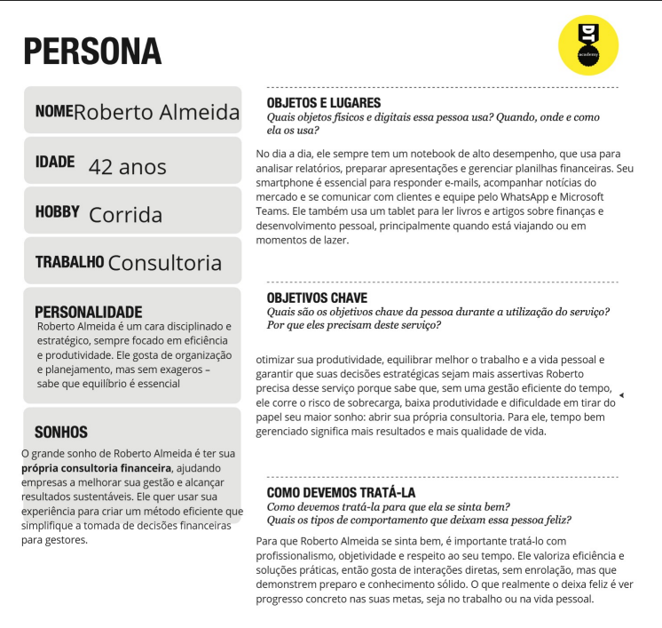

# Product Discovery

## Etapa de Entendimento

### Matriz CSD e Mapa de Stakeholders

A Matriz CSD (Certezas, Suposições e Dúvidas) foi construída com base em análises iniciais sobre o problema da má gestão de tempo entre profissionais autônomos e liberais. Através da CSD e do Mapa de Stakeholders, conseguimos identificar os principais envolvidos nesse contexto, como clientes, familiares e colegas de profissão. A análise forneceu direcionamentos para as entrevistas e definições seguintes do projeto.

### Entrevistas Qualitativas e Highlights de Pesquisa

As entrevistas foram realizadas com três perfis distintos de profissionais: um advogado de família, um azulejista autônomo e um consultor financeiro. Cada um apresentou dificuldades únicas na gestão de tempo e organização das tarefas. As informações extraídas foram sintetizadas em highlights para facilitar a identificação dos padrões e dores comuns entre os usuários.

  
  

## Etapa de Definição

### Personas

A seguir, foram desenvolvidas três personas com base nos dados reais das entrevistas.

**Carlos Silva – Advogado de Família (45 anos)**  
Pessoa calma, metódica e pouco interativa. Gosta de escrever e sonha em publicar um livro. Sua maior dor é equilibrar trabalho com lazer. Precisa de uma ferramenta que o ajude a otimizar seu tempo entre demandas jurídicas e vida pessoal.

**Claudio – Autônomo (44 anos, Azulejista)**  
Focado, perfeccionista e habilidoso em seu trabalho, mas com dificuldades na administração do tempo. Busca organização para não perder prazos e equilibrar compromissos pessoais. A tecnologia ideal para ele deve ser simples e prática.

**Roberto Almeida – Consultor Financeiro (42 anos)**  
Disciplinado, estratégico e orientado por produtividade. Quer melhorar sua performance e abrir seu próprio negócio. Sua principal dor é o excesso de tarefas e a falta de foco. O aplicativo deve permitir planejamento estratégico com soluções objetivas e diretas.

---

### Links do Miro
| Tópico                                            | Links de acesso                                                                 |
|---------------------------------------------------|----------------------------------------------------------------------|
| Matriz CSD e Mapa de Stakeholders                | [Acessar Miro](https://miro.com/app/board/uXjVIXQgrqA=/)             |
| Entrevistas Qualitativas e Highlights de Pesquisa | [Acessar Miro](https://miro.com/app/board/uXjVIT43YvI=/)             |
| Personas                                          | [Acessar Miro](https://miro.com/app/board/uXjVIPrSoeA=/)             |

