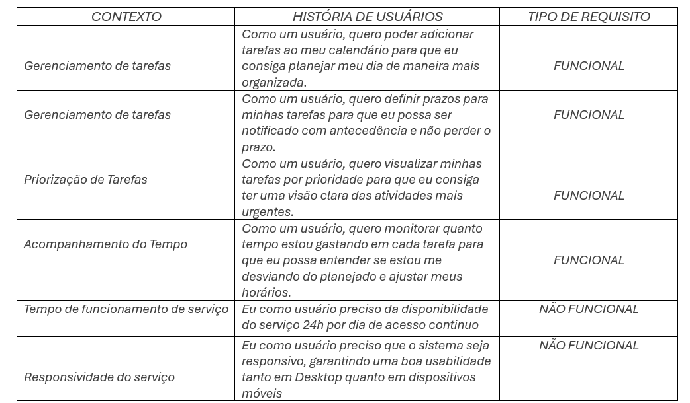

# Product design

## Histórias de usuários

Com base na análise das personas, foram identificadas as seguintes histórias de usuários:

> Apresente aqui as histórias de usuários que são relevantes para o projeto da sua solução. As histórias de usuários consistem em uma ferramenta poderosa para a compreensão e elicitação dos requisitos funcionais e não funcionais da sua aplicação. Se possível, agrupe as histórias de usuários por contexto, para facilitar consultas recorrentes a esta parte do documento.

## Proposta de valor

## Requisitos

As tabelas a seguir apresentam os requisitos funcionais e não funcionais que detalham o escopo do projeto. Para determinar a prioridade dos requisitos, aplique uma técnica de priorização e detalhe como essa técnica foi aplicada.

### Requisitos funcionais

### Requisitos não funcionais

 

> Com base nas histórias de usuários, enumere os requisitos da sua solução. Classifique esses requisitos em dois grupos:

- Requisitos funcionais
(RF1): Criação de tarefas
(RF2): Notificações e lembretes
(RF3): Encerramento de tarefas
(RF4): Categorização de tarefas
(RF5): Vizualização de tarefas por data e prioridade
(RF6): Criação de eventos com data e hora específicas
(RF7): Relatório semanal do tempo gasto em cada categoria de tarefa
(RF8): Definição de metas de produtividade e acompanhamento de progresso 
(RF9): Sugestões de otimização de tempo com base nos hábitos do usuário

- Requisitos não funcionais
(RNF1): Disponibilidade do sistema 24/7
(RNF2): Responsibilidade e usabilidade do sistema

Lembre-se de que cada requisito deve corresponder a uma e somente uma característica-alvo da sua solução. Além disso, certifique-se de que todos os aspectos capturados nas histórias de usuários foram cobertos.

## Restrições

Enumere as restrições à sua solução. Lembre-se de que as restrições geralmente limitam a solução candidata.

O projeto está restrito aos itens apresentados na tabela a seguir.

|ID|                            Restrição                                            |
|--|-------------------------------------------------------|
|001| O sistema deve ser desenvolvido utilizando React.js no front-end e Node.js no back-end.  |
|002| A base de dados deverá ser armazenada em um banco SQL (PostgreSQL ou MySQL).    |
