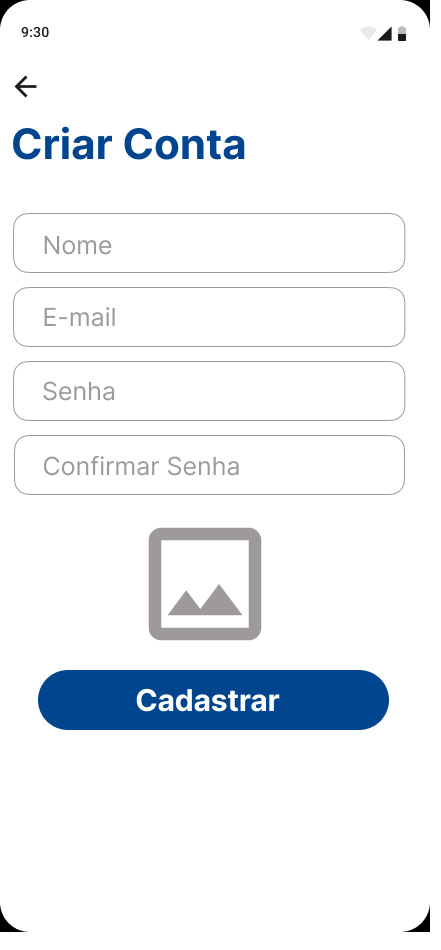
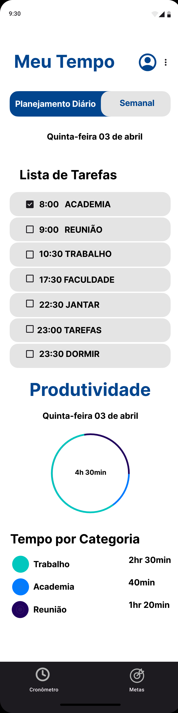

# Projeto de Interface

## User Flow

Fluxo geral da navegação do usuário nas principais funcionalidades do sistema:

---
## Wireframes

Apresentação das principais telas da aplicação. Cada wireframe foi desenvolvido com foco em usabilidade, organização visual e resposta aos requisitos definidos no Product Design.

<table>
  <tr>
    <td></td>
    <td>
      <strong>Tela de Carregamento</strong> 
      Exibida ao iniciar o aplicativo, com o logotipo centralizado durante o carregamento inicial.
    </td>
  </tr>
  <tr>
    <td></td>
    <td>
      <strong>Tela de Login</strong> 
      Permite que o usuário insira suas credenciais para acessar a plataforma.
    </td>
  </tr>
  <tr>
    <td></td>
    <td>
      <strong>Tela de Cadastro</strong> 
      Formulário para novos usuários criarem uma conta no sistema.
    </td>
  </tr>
  <tr>
    <td></td>
    <td>
      <strong>Home</strong> 
      Página inicial com acesso rápido às principais funções como tarefas, metas e cronômetro.
    </td>
  </tr>
  <tr>
    <td></td>
    <td>
      <strong>Planejamento Semanal</strong> 
      Exibe a organização das tarefas da semana com opção de visualizar, editar ou excluir.
    </td>
  </tr>
  <tr>
    <td></td>
    <td>
      <strong>Sons e Músicas</strong> 
      Configurações para ativar músicas ambiente ou sons de foco durante as tarefas.
    </td>
  </tr>
  <tr>
    <td></td>
    <td>
      <strong>Perfil do Usuário</strong> 
      Área onde o usuário pode editar seus dados, redefinir senha e revisar atividades.
    </td>
  </tr>
  <tr>
    <td></td>
    <td>
      <strong>Notificações</strong> 
      Permite configurar lembretes e alertas personalizados para manter o foco.
    </td>
  </tr>
  <tr>
    <td></td>
    <td>
      <strong>Cronômetro</strong> 
      Ferramenta para marcar o tempo das tarefas realizadas, seguindo a técnica Pomodoro.
    </td>
  </tr>
  <tr>
    <td></td>
    <td>
      <strong>Metas</strong> 
      Interface para criação, edição e monitoramento das metas do usuário.
    </td>
  </tr>
  <tr>
    <td></td>
    <td>
      <strong>Avaliação</strong> 
      Tela para o usuário dar feedback sobre o aplicativo com uma nota de até 5 estrelas.
    </td>
  </tr>
</table>

## Protótipo Interativo

Você pode assistir ao vídeo de demonstração clicando no link abaixo:

[▶ Ver vídeo do protótipo](images/Iframe.mp4)

### Acesse também o protótipo no Figma:

[Protótipo interativo no Figma](https://www.figma.com/proto/6XQFY8oyfAkyrj5PYyrovW/prot%C3%B3tipo-interativo?node-id=1-2&t=Ahj1ocssFcL21f0l-1)
