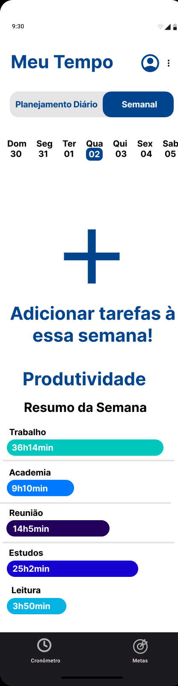

# Projeto de Interface

**Pré-requisitos:** [Product Design](03-Product-design.md)

Este documento apresenta uma visão geral da interação do usuário com o sistema, por meio das telas e funcionalidades disponíveis, bem como um protótipo interativo. As interfaces foram desenvolvidas para atender aos **requisitos funcionais**, **não funcionais** e às **histórias de usuário** abordadas na etapa de [Product Design](03-Product-design.md).

---

## User Flow

Fluxo geral da navegação do usuário nas principais funcionalidades do sistema:

---

## Wireframes

Apresentação das principais telas da aplicação:

| Tela | Descrição |
|------|-----------|
|  | Tela de carregamento ao abrir o aplicativo |
|  | Tela de login do usuário |
|  | Tela de cadastro de novos usuários |
|  | Tela inicial com o menu principal |
|  | Visualização do planejamento semanal de tarefas |
|  | Tela para configurar sons e músicas ambientes |
|  | Configurações do perfil, tarefas e dados pessoais |
|  | Configuração de notificações personalizadas |
|  | Tela com cronômetro de atividades |
|  | Criação e gerenciamento de metas pessoais |
|  | Avaliação do aplicativo (até 5 estrelas) |

---

## Protótipo Interativo

### Visualização do vídeo:

<video width="560" height="315" controls>
  <source src="images/Iframe.mp4" type="video/mp4">
  Seu navegador não suporta a exibição de vídeos.
</video>

### Acesse o protótipo completo no Figma:

✅ [Clique aqui para acessar o protótipo interativo no Figma](https://www.figma.com/proto/6XQFY8oyfAkyrj5PYyrovW/prot%C3%B3tipo-interativo?node-id=1-2&t=Ahj1ocssFcL21f0l-1)

---
