# Arquitetura da solução

<span style="color:red">Pré-requisitos: <a href="05-Projeto-interface.md"> Projeto de interface</a></span>

Pré-requisitos
- Projeto construído em HTML, CSS e JavaScript.
- Backend com JSON Server para simular uma API RESTful.
- Interface responsiva inspirada em Material Design.
- Editor de código: Visual Studio Code.
- Testes de API realizados com Postman.

Estrutura da Solução
A solução é dividida em três principais camadas:
1. Interface do Usuário (Frontend):
- Tela de cadastro de atividades;
- Tela de visualização dos cronômetros;
- Timer circular animado via SVG;
- Integração com JSON Server para persistência dos dados.

2. Serviço de Dados (Backend Simulado):
- JSON Server com endpoints REST (GET, POST, PUT, DELETE);
- Banco de dados simulado via arquivo db.json.

3. Ambiente de Hospedagem:
- Hospedado no GitHub Pages para frontend;
- JSON Server rodando localmente ou via ferramenta como Repl.it ou Glitch para testes.


## Funcionalidades

##### Funcionalidade 1 -  Ativar e desativar as notificações

Funcionalidade que permite ao usuário ativar e desativar as notificações

* **Estrutura de dados:** [Notificações](#estrutura-de-dados---notificações)
* **Instruções de acesso:**
  * Acessar a tela de notificações
  * Clicar no botão de Lembrete de Tarefas
  * Aguardar resultado
* **Tela da funcionalidade**:

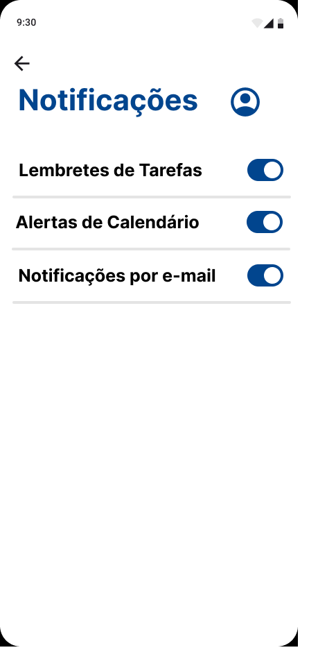

##### Funcionalidade 2 -  Metas

Funcionalidade que permite ao usuário adicionar e editar metas

* **Estrutura de dados:** [Metas](#estrutura-de-dados---metas)
* **Instruções de acesso:**
  * Acessar a tela de Metas
  * Clicar no botão de adicionar metas (simbolo de +)
  * Aguardar resultado
* **Tela da funcionalidade**:

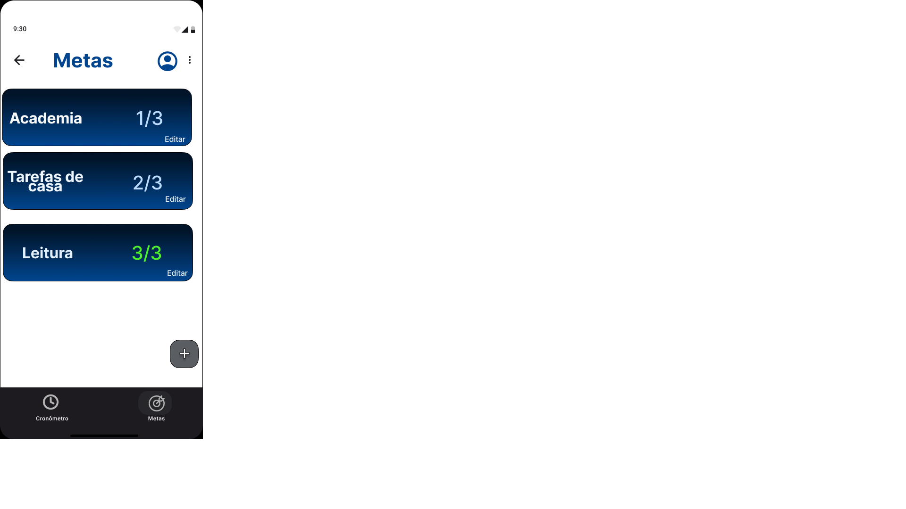

##### Funcionalidade 3 -  Criação de temporizador

Funcionalidade que permite ao usuário acessar a página de criação de temporizador para cronômetro

* **Estrutura de dados:** [criação de temporizador](#estrutura-de-dados---criação-de-temporizador)
* **Instruções de acesso:**
  * Acessar a tela de Cronômetro
  * Clicar no botão com simbolo de +
* **Tela da funcionalidade**:

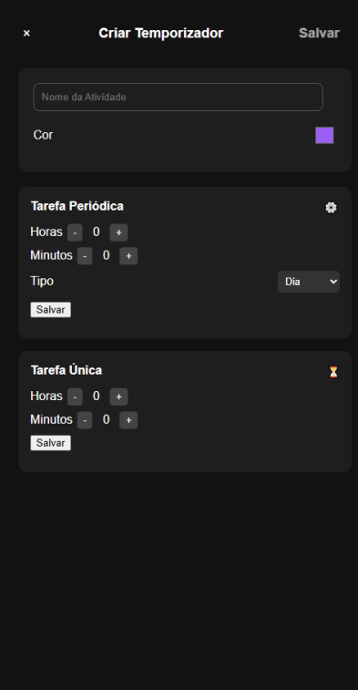

##### Funcionalidade 4 -  Exibição de temporizador

Funcionalidade que exibe cronômetro criado e permite iniciar, pausar e excluir o tempo registrado em uma atividade.


* **Estrutura de dados:** [Exibir temporizador](#estrutura-de-dados---exibir-temporizador)
* **Instruções de acesso:**
  * Acessar a tela cronômetro (O temporizador deve ser criado primeiro no icone "+")
  * Aguardar a exibição do cronômetro
* **Tela da funcionalidade**:

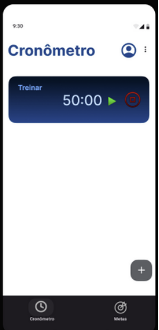

##### Funcionalidade 5 -  Gráfico de produtividade diária

Funcionalidade que permite ao usuário acessar a página de criação de temporizador para cronômetro

* **Estrutura de dados:** [Gráfico Produtividade](#estrutura-de-dados---gráfico-produtividade)
* **Instruções de acesso:**
  * Acessar a tela inicial
  * Clicar em planejamento diário
  * Rolar a tela até o final 
* **Tela da funcionalidade**:

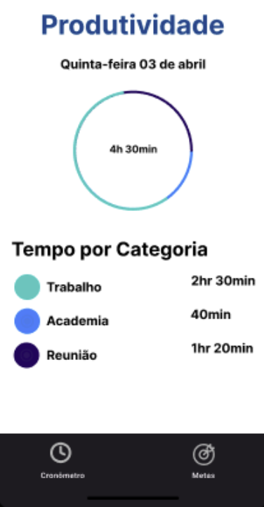

##### Funcionalidade 6 -  Adicionar tarefa semanal

Funcionalidade permitir que o usuário adicione tarefas em sua lista semanal, pondendo escolher o dia da semana em que vai adicionar ou exlcuir a tarefa

* **Estrutura de dados:** [Adicionar tarefa semanal](#estrutura-de-dados---adicionar-tarefa-semanal)
* **Instruções de acesso:**
  * Acessar a tela principal
  * Clicar em planejamento semanal
* **Tela da funcionalidade**:


##### Funcionalidade 7 -  Adicionar tarefa diária

Funcionalidade permitir que o usuário adicione tarefas para o dia atual

* **Estrutura de dados:** [Adicionar tarefa diária](#estrutura-de-dados---adicionar-tarefa-diária)
* **Instruções de acesso:**
  * Acessar a tela principal
  * Clicar em planejamento diário
* **Tela da funcionalidade**:

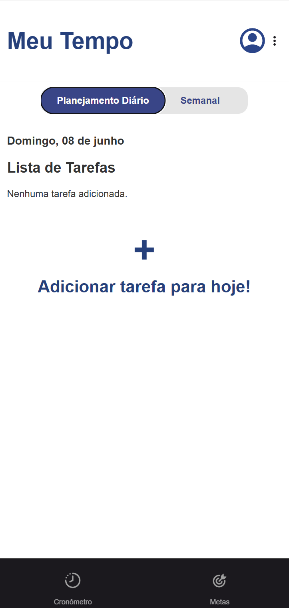

##### Funcionalidade 8 -  Cadastro/Login usuário

Funcionalidade permitir que o usuário logar no aplicativo caso já tenha uma conta, se não tiver poderar fazer o cadastro

* **Estrutura de dados:** [Login](#estrutura-de-dados---login)
* **Instruções de acesso:**
  * Acessar a tela inicial de login
  * Efeturar login (A conta precisa estar cadastrada)
* **Tela da funcionalidade**:

* **Estrutura de dados:** [Cadastro](#estrutura-de-dados---cadastro)
* **Instruções de acesso:**
  * Acessar a tela inicial de login
  * Clicar em cadastro na parte inferior da tela
* **Tela da funcionalidade**:

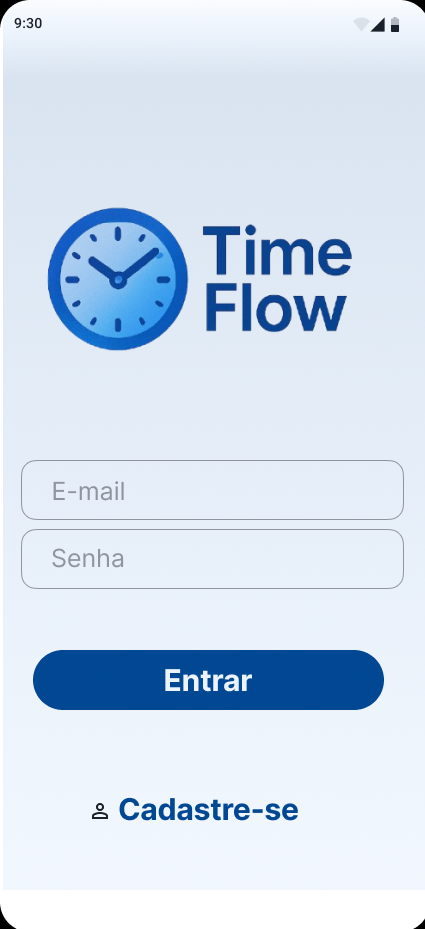
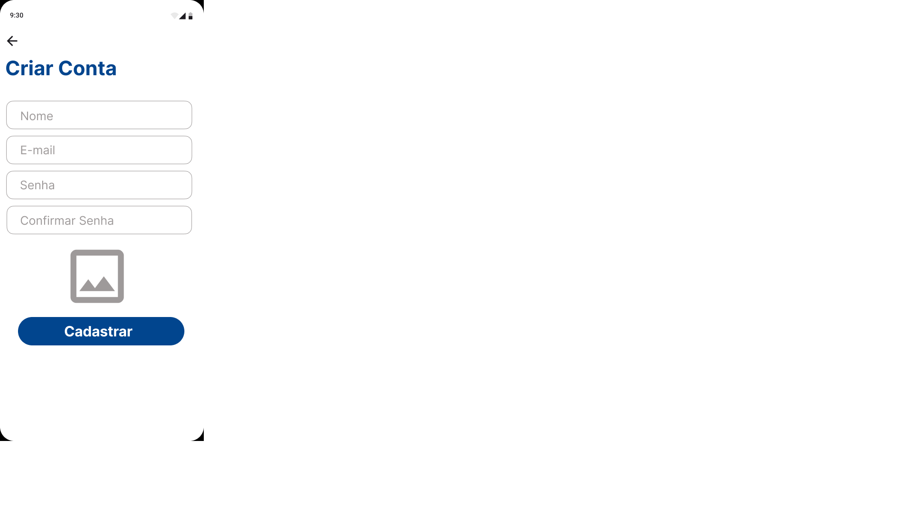

##### Funcionalidade 9 -  Alterar foto do Perfil

Funcionalidade permitir que o usuário altere sua foto de perfil

* **Estrutura de dados:** [Alterar foto](#estrutura-de-dados---alterar-foto)
* **Instruções de acesso:**
  * Acessar a tela principal
  * Clicar no icone de perfil de usuario
  * Clicar na sua foto

* **Tela da funcionalidade**:

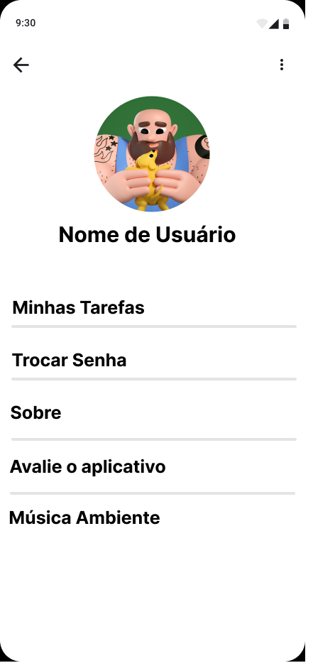

##### Funcionalidade 10 -  Avaliação do app

Funcionalidade permitir que o usuário avalie o app

* **Estrutura de dados:** [Avaliar app](#estrutura-de-dados---avaliar-app)
* **Instruções de acesso:**
  * Acessar a tela principal
  * Clicar no icone de perfil de usuario
  * Ir até "Avalie o aplicativo" é clicar nele

* **Tela da funcionalidade**:

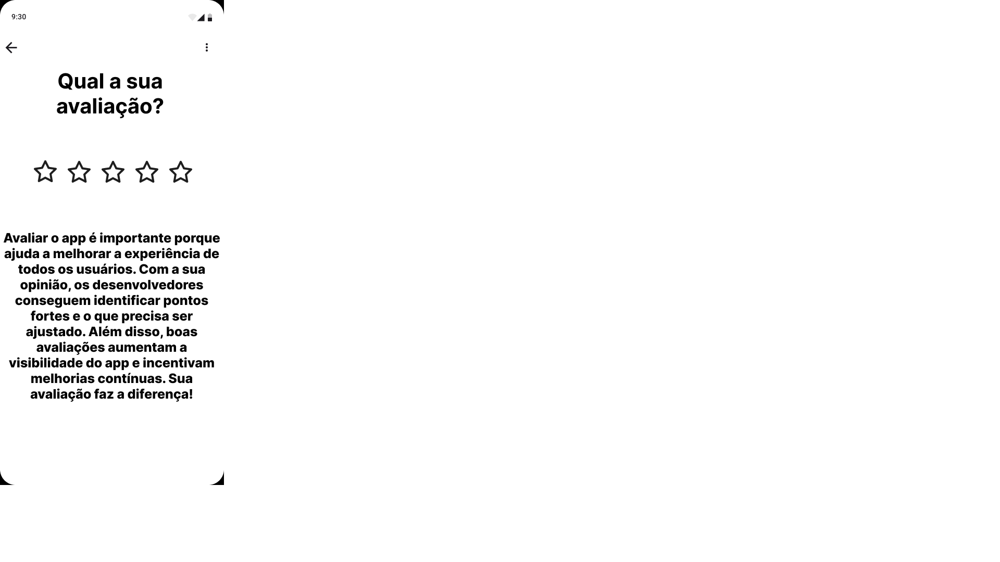

##### Funcionalidade 10 -  Escolher som ou música ambiente

Funcionalidade permitir que o usuário escolha uma música de fundo para usar e altere o som das notificações

* **Estrutura de dados:** [Sons e música](#estrutura-de-dados---sons-e-música)
* **Instruções de acesso:**
  * Acessar a tela principal
  * Clicar no icone de perfil de usuario
  * Ir até "Música ambiente" é clicar nele

* **Tela da funcionalidade**:

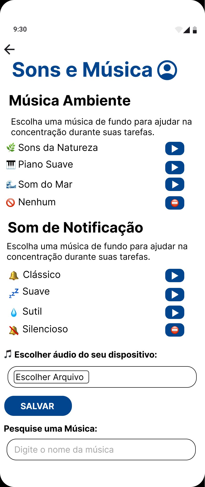


### Estruturas de dados

Descrição das estruturas de dados utilizadas na solução com exemplos no formato JSON.Info.

##### Estrutura de dados - Notificações

Configurações de notificação do usuário, como lembretes de tarefas e alertas de calendário.

```json
{
    "usuario": {
    "id": 1,
    "nome": "João Silva",
    "notificacoes": {
    "lembretesDeTarefas": true,
    "alertasDeCalendario": true
    }
  }
}

```
##### Estrutura de dados - Metas

Registro de metas criadas pelo usuário com contador de progresso

```json

{
  "id": 104,
  "titulo": "Nova Meta",
  "concluidas": 0,
  "total": 3
}
```
##### Estrutura de dados - Criação de temporizador

Dados enviados ao criar um novo temporizador personalizado.

```json

{
  "nome": "Nome da Atividade",
  "cor": "Cor da Atividade",
  "tempo": "HH:MM",
  "segundosTotais": 3600,
  "decorrido": 0
}
```

##### Estrutura de dados - Exibir temporizador

Dados utilizados para renderizar temporizadores ativos e pausados na tela.

```json
 {
  "nome": "Nome da Atidade",
  "cor": "Cor Escolhida",             
  "tempo": "HH:MM",            
  "segundosTotais": 7200,       
  "decorrido": 0,         
  "ativo": false                
} 
```
##### Estrutura de dados - Gráfico Produtividade

Dados utilizados para montar um gráfico com o tempo investido em cada atividade.

```json
[
  {
    "nome": "Estudar",
    "tempo": "1h 30min",
    "cor": "#FF5733"
  },
  {
    "nome": "Exercícios",
    "tempo": "2h",
    "cor": "#4287f5"
  }
]
```
##### Estrutura de dados - Adicionar tarefa semanal

Tarefas registradas para a semana selecionada, organizadas por data.

```json
{
  "semana": "2025-06-09",
  "tarefas": [
    {
      "dia": "2025-06-09",
      "horaInicio": "12:00",
      "horaFim": null,
      "descricao": "estudar",
      "concluida": false
    },
    {
      "dia": "2025-06-09",
      "horaInicio": "15:00",
      "horaFim": "21:00",
      "descricao": "trabalhar",
      "concluida": false
    }
  ]
}
```
##### Estrutura de dados - Adicionar tarefa diária

Tarefas registradas para o dia atual, com horários e status de conclusão.

```json
{
  "data": "2025-06-08",
  "tarefas": [
    {
      "horaInicio": "08:00",
      "horaFim": "09:30",
      "descricao": "Aula de Natação",
      "concluida": true
    },
    {
      "horaInicio": "10:00",
      "horaFim": "11:00",
      "descricao": "Leitura",
      "concluida": false
    },
    {
      "horaInicio": "12:40",
      "horaFim": "20:40",
      "descricao": "Trabalho",
      "concluida": false
    }
  ]
}
```
##### Estrutura de dados - Login

Credenciais do usuário utilizadas para autenticação no sistema.

```json
{
  "email": "usuario@exemplo.com",
  "senha": "minhaSenha123"
}
```
##### Estrutura de dados - Cadastro

Dados necessários para criar uma nova conta de usuário.

```json
{
  "nome": "João Silva",
  "email": "joao@exemplo.com",
  "senha": "senhaForte123",
  "confirmarSenha": "senhaForte123"
}
```
##### Estrutura de dados - Alterar foto

Atualiza a imagem de perfil do usuário.

```json
{
  "usuarioId": 1,
  "fotoPerfil": "data:image/png;base64,iVBORw0KGgoAAAANSUhEUgAA..."
}
```
##### Estrutura de dados - Avaliar app

Registra a avaliação do usuário sobre o aplicativo com nota, comentário e data.

```json
{
  "usuarioId": 1,
  "avaliacao": 5,
  "comentario": "Aplicativo excelente! Interface intuitiva e fácil de usar.",
  "data": "2025-06-08T14:32:00Z"
}
```
##### Estrutura de dados - Sons e música

Preferências do usuário quanto ao som ambiente e sons de notificação.

```json
{
  "musicaAmbiente": {
    "selecionado": "Sons da Natureza",
    "opcoes": [
      "Sons da Natureza",
      "Nenhum"
    ]
  },
  "somNotification": {
    "selecionado": "Clássico",
    "opcoes": [
    "Clássico",
    "Silencioso"
    ]
  }
}
```


##### Estrutura de dados - Usuários  ⚠️ EXEMPLO ⚠️

Registro dos usuários do sistema utilizados para login e para o perfil do sistema.

```json
  {
    id: "eed55b91-45be-4f2c-81bc-7686135503f9",
    email: "admin@abc.com",
    id: "eed55b91-45be-4f2c-81bc-7686135503f9",
    login: "admin",
    nome: "Administrador do Sistema",
    senha: "123"
  }
```


### Módulos e APIs

Esta seção apresenta os módulos e APIs utilizados na solução.

**Images**:


**Fonts:**

* Icons Font Face - [https://fontawesome.com/](https://fontawesome.com/) ⚠️ EXEMPLO ⚠️

**Scripts:**

* jQuery - [http://www.jquery.com/](http://www.jquery.com/) ⚠️ EXEMPLO ⚠️
* Bootstrap 4 - [http://getbootstrap.com/](http://getbootstrap.com/) ⚠️ EXEMPLO ⚠️

## Hospedagem

Explique como a hospedagem e o lançamento da plataforma foram realizados.

> **Links úteis**:
> - [Website com GitHub Pages](https://pages.github.com/)
> - [Programação colaborativa com Repl.it](https://repl.it/)

